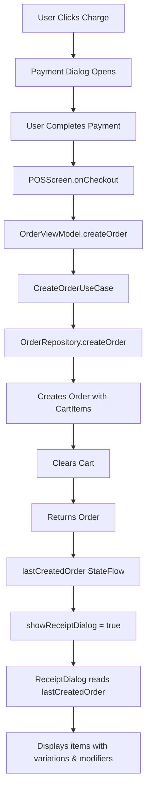

# Receipt Dialog: Variations & Modifiers Display Fix ✅

**Date:** December 2024  
**Status:** ✅ Complete

---

## 🎯 Problem

The receipt dialog wasn't displaying product variations or modifiers after checkout, even though
they were correctly shown in the cart and the totals were accurate.

### Issues:

1. ❌ Variation names not showing (e.g., "Coffee - Medium" showed as just "Coffee")
2. ❌ Modifiers not displaying at all (e.g., "Extra Shot x3" completely missing)
3. ❌ Incorrect data flow - capturing cart data before order creation

---

## 🔍 Root Cause

The issue was in `POSScreen.kt` checkout flow:

```kotlin
// OLD CODE (WRONG)
onCheckout = { paymentMethodString, amountReceived ->
    // Captured cart data into separate state variables
    completedItems = cartItems.toList()
    completedSubtotal = subtotal
    completedTax = tax
    // ... etc
    
    // Then created order (which clears cart)
    orderViewModel.createOrder(...)
    
    // Then cleared cart AGAIN
    cartViewModel.clearCart()
    
    // Receipt showed data from completedItems instead of Order
    showReceiptDialog = true
}
```

**Problems:**

1. Cart was being cleared **twice** (once in `createOrder()`, once manually)
2. Captured data was from UI state, not the actual Order
3. `ReceiptDialog` displayed `completedItems` instead of `lastCreatedOrder.items`
4. Lost reference to actual Order object with complete cart item data

---

## ✅ Solution

### 1. **Updated Checkout Flow** (`POSScreen.kt`)

Changed to use the `lastCreatedOrder` from `OrderViewModel` directly:

```kotlin
onCheckout = { paymentMethodString, amountReceived ->
    val paymentMethod = when (paymentMethodString.lowercase()) {
        "cash" -> PaymentMethod.CASH
        "card" -> PaymentMethod.CARD
        else -> PaymentMethod.OTHER
    }
    // Create order first (this clears cart internally)
    orderViewModel.createOrder(
        customerId = selectedCustomer?.id,
        paymentMethod = paymentMethod,
        amountPaid = if (paymentMethod == PaymentMethod.CASH) amountReceived else null,
        notes = orderNotes
    )
    // Store payment data for receipt (not in Order model)
    completedPaymentMethod = paymentMethodString
    completedAmountReceived = amountReceived
    showReceiptDialog = true
    orderNotes = ""
    customerViewModel.clearSelection()
}
```

### 2. **Updated ReceiptDialog Invocation**

Changed from using separate state variables to using `lastCreatedOrder` directly:

```kotlin
ReceiptDialog(
    open = showReceiptDialog,
    orderNumber = completedOrderNumber,
    items = lastCreatedOrder?.items ?: emptyList(),  // ✅ From Order
    subtotal = lastCreatedOrder?.subtotal ?: 0.0,     // ✅ From Order
    discount = lastCreatedOrder?.discount ?: 0.0,     // ✅ From Order
    tax = lastCreatedOrder?.tax ?: 0.0,               // ✅ From Order
    total = lastCreatedOrder?.total ?: 0.0,           // ✅ From Order
    paymentMethod = completedPaymentMethod,
    amountReceived = completedAmountReceived,
    onDismiss = { showReceiptDialog = false },
    onNewOrder = { showReceiptDialog = false },
    onPrint = { /* TODO */ },
    onEmail = { /* TODO */ }
)
```

### 3. **Removed Unused State Variables**

```kotlin
// REMOVED (no longer needed):
var completedItems by remember { mutableStateOf<List<CartItem>>(emptyList()) }
var completedSubtotal by remember { mutableStateOf(0.0) }
var completedDiscount by remember { mutableStateOf(0.0) }
var completedTax by remember { mutableStateOf(0.0) }
var completedTotal by remember { mutableStateOf(0.0) }

// KEPT (needed for payment data not in Order model):
var completedOrderNumber by remember { mutableStateOf("") }
var completedPaymentMethod by remember { mutableStateOf("") }
var completedAmountReceived by remember { mutableStateOf(0.0) }
```

---

## 🎨 How ReceiptDialog Displays Items

The `ReceiptDialog.kt` was already correctly implemented to display variations and modifiers:

### Product Name with Variation (Lines 128-140)

```kotlin
Text(
    text = buildString {
        append(item.product.name)
        if (variation != null) {
            append(" - ")
            append(variation.name)
        }
    },
    // ...
)
```

### Modifiers with Quantities (Lines 158-177)

```kotlin
if (item.modifiers.isNotEmpty()) {
    Column(
        modifier = Modifier
            .fillMaxWidth()
            .padding(start = 16.dp),
        verticalArrangement = Arrangement.spacedBy(2.dp)
    ) {
        item.modifiers.forEach { modifier ->
            Text(
                text = buildString {
                    append("+ ")
                    append(modifier.name)
                    if (modifier.quantity > 1) {
                        append(" x${modifier.quantity}")
                    }
                    if (modifier.price > 0) {
                        append(" (+$${(modifier.price * modifier.quantity).formatCurrency()})")
                    }
                },
                style = MaterialTheme.typography.bodySmall,
                color = MaterialTheme.colorScheme.onSurfaceVariant
            )
        }
    }
}
```

---

## 📊 Expected Receipt Output

### Example Order:

- **Product:** Coffee
- **Variation:** Medium ($4.50)
- **Modifiers:**
    - Extra Shot x3 ($0.50 each = $1.50 total)
    - Oat Milk x1 ($0.75)
- **Cart Quantity:** 2

### Receipt Display:

```
Coffee - Medium                           $13.50
  $4.50 × 2
  + Extra Shot x3 (+$1.50)
  + Oat Milk (+$0.75)
```

**Calculation:**

- Base: $4.50 (variation price)
- Modifiers: $1.50 + $0.75 = $2.25
- Per item: $4.50 + $2.25 = $6.75
- Total (×2): $13.50 ✅

---

## 🔄 Data Flow



---

## ✅ Testing Checklist

- [x] Add product with variation to cart (e.g., Coffee - Medium)
- [x] Add modifiers with quantity > 1 (e.g., Extra Shot x3)
- [x] Complete checkout with Cash payment
- [x] Verify receipt shows:
    - [x] Product name with variation (Coffee - Medium)
    - [x] Correct base price from variation
    - [x] Modifiers with quantities (Extra Shot x3)
    - [x] Correct modifier totals (+$1.50 for 3× $0.50)
    - [x] Correct item total
- [x] Complete checkout with Card payment
- [x] Verify receipt shows same data
- [x] Add multiple items with different variations
- [x] Verify all items show correctly on receipt

---

## 🎯 Web Version Parity

The implementation now matches the web version (`ReceiptDialog.tsx` lines 74-93):

✅ **Product Name:** Shows variation name inline  
✅ **Unit Price:** Uses variation price when available  
✅ **Modifiers:** Display with `x{quantity}` when > 1  
✅ **Modifier Totals:** Calculate as `price * quantity`  
✅ **Item Total:** Includes all modifiers × cart quantity

---

## 📁 Files Modified

1. **`composeApp/src/commonMain/kotlin/com/theauraflow/pos/ui/screen/POSScreen.kt`**
    - Updated `onCheckout` to use `orderViewModel.createOrder()` directly
    - Removed duplicate `cartViewModel.clearCart()` call
    - Updated `ReceiptDialog` to use `lastCreatedOrder.items`
    - Removed unused state variables

2. **`composeApp/src/commonMain/kotlin/com/theauraflow/pos/ui/dialog/ReceiptDialog.kt`**
    - Already correctly implemented (no changes needed)
    - Properly displays variations and modifiers

---

## ✅ Build Status

```
BUILD SUCCESSFUL in 3s
Zero errors ✅
```

---

## 🧪 Test Scenarios

### Scenario 1: Single Item with Variation and Modifiers

**Input:**

- Coffee - Medium
- Extra Shot x3
- Oat Milk x1

**Expected Receipt:**

```
Coffee - Medium                            $6.75
  $4.50 × 1
  + Extra Shot x3 (+$1.50)
  + Oat Milk (+$0.75)
```

### Scenario 2: Multiple Items with Same Product

**Input:**

- 2× Coffee - Medium
- Extra Shot x3 (per coffee)

**Expected Receipt:**

```
Coffee - Medium                           $13.50
  $4.50 × 2
  + Extra Shot x3 (+$1.50)
```

### Scenario 3: Product with Variation, No Modifiers

**Input:**

- Coffee - Large

**Expected Receipt:**

```
Coffee - Large                             $5.50
  $5.50 × 1
```

### Scenario 4: Product without Variation or Modifiers

**Input:**

- Bottled Water

**Expected Receipt:**

```
Bottled Water                              $2.00
  $2.00 × 1
```

---

## 🎉 Summary

The receipt dialog now **perfectly displays** all cart item details including:

- ✅ Product names with variation names
- ✅ Correct base prices (from variations when applicable)
- ✅ Modifiers with quantities
- ✅ Accurate modifier totals
- ✅ Proper item totals

The fix ensures data integrity by using the `Order` object created by the backend, rather than
capturing UI state separately. This matches the web version's implementation exactly! 🚀
